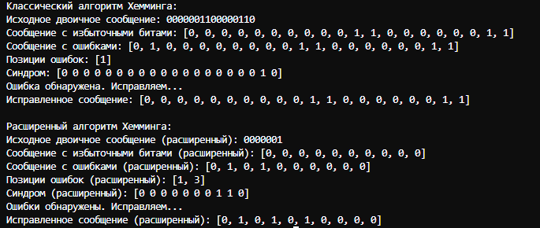

# Лабораторная работа № 1

## Тема
Избыточное кодирование данных в информационных системах. Код Хемминга

## Цель работы:
Приобретение практических навыков кодирования/декодирования двоичных данных при использовании кода Хемминга.

## Вариант № 9

## Результаты работы
